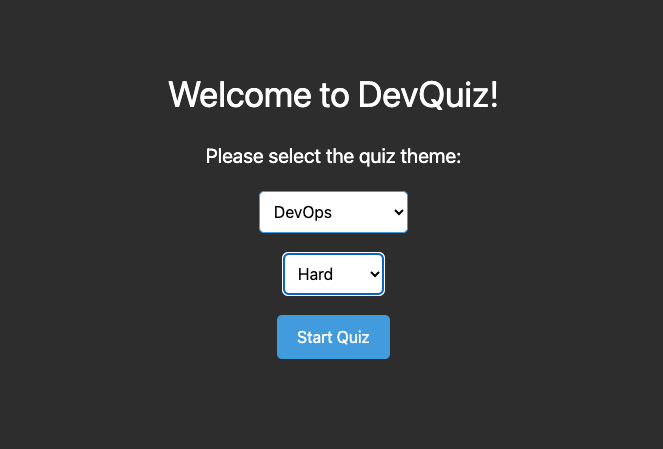

# Projeto: Consumindo uma API pública (FORK)

<b>Esse projeto é um fork de: https://github.com/elc1090/project2-2024a-aapi-renan</b>

Deploy: https://quiz-app-latest.onrender.com

### Desenvolvedores

- Alfredo Cossetin Neto
- Mauro Roberto Machado Trevisan

## Alterações

Foram feitas alterações na Página Inicial do App:
- A caixa de seleção de Tema agora mostra uma lista dinâmica de temas válidos para seleção;
- O Tema selecionado pelo usuário agora persiste e é direcionado à página de Quiz para de fato filtrar as perguntas;
- Foi adicionado uma caixa de seleção de dificuldade de perguntas;

### Tecnologias adicionais

- Docker : Desenvolvimento e testagem das alterações em ambiente local, bem como para implantação do serviço em nuvem

## Descrição original

> ### Produto
> 
> Quiz de Programação
> Quiz com perguntas que tocam em várias áreas da programação e desenvolvimento de software, como Linguagens, Frameworks, Bibliotecas, Conceitos, Paradigmas, Ferramentas, etc.
> 
> ### API escolhida
> 
> ~~Iremos utilizar o web-aplicativo Notion para criar nossas tabelas e fazer chamadas de API.~~
> 
> Consumimos a API do QuizAPI para nossas perguntas.
> 
> - [~~Notion~~](https://www.notion.so/pt-br)
> - [QuizAPI](https://quizapi.io/)
> 
> ### Desenvolvimento
> 
> 1) Começamos criando instalando React no repositório do projeto e criando um design básico no Figma.
> 2) Tentamos adicionar TailWind para estilização, porém depois de muitos problemas para fazer funcionar acabamos desistindo e utilizando uma biblioteca de estilização chamada Styled Components.
> 3) Criamos a base do aplicativo com React, como nenhum dos dois participantes do grupo era experiente com o framework, utilizamos a ajuda do ChatGPT para construir a estrutura base do projeto.
> 4) Com alguns componentes já feitos, integramos tudo em uma única tela de forma a ter um fluxo de execução funcional.
> 5) Após isso, tentamos integrar nosso fluxo já existente com a API do Notion, porém novamente tivemos muitos problemas e decidimos partir para uma solução mais simples.
> 6) Adicionamos então uma chamada para a API do quizapi.io para buscar as perguntas que iriamos utilizar no nosso quiz.
> 7) Então, após um bom tempo corrigindo problemas no programa, chegamos a um fluxo de exexução funcional e bem decente.
> 
> #### Tecnologias
> 
> - ~~[Notion](https://www.notion.so/pt-br) (API e Backend)~~
> - [QuizAPI](https://quizapi.io/) (API e Backend)
> - [React](https://pt-br.legacy.reactjs.org/) (Frontend)
> - ~~[TailWind](https://tailwindcss.com/) (Styling)~~
> - [Styled Components](https://styled-components.com/) (Styling)
> - [ChatGPT](https://chat.openai.com/)
> 
> #### Ambiente de desenvolvimento
> 
> - [VS Code](https://code.visualstudio.com/) (IDE)
> - [Google Chrome](https://www.google.com/intl/pt-BR/chrome/) (Navegador)
> - [Brave](https://brave.com/pt-br/) (Navegador)
> - [WebStorm](https://www.jetbrains.com/webstorm) (IDE)
> - [Edge](https://www.microsoft.com/pt-br/edge/download?form=MA13FJ) (Navegador) 
> 
> #### Referências e créditos
> 
> - [ChatGPT](https://chat.openai.com/) foi bastante usado para rearranjar elementos na tela e para estilização, então temos muitos prompts do tipo: "put it into a floating container and make the background dark", "make the container brighter", "centralize the page title and put the score to the very right of the appbar, also put the question underneath the question number, on a different line", vários prompts desse tipo.
> - [StackOverflow](https://stackoverflow.com/) foi muito usado também, em páginas como [How to work with styled components in my react app?](https://stackoverflow.com/questions/42374080/how-to-work-with-styled-components-in-my-react-app), [Switch' is not exported from 'react-router-dom'](https://stackoverflow.com/questions/69843615/switch-is-not-exported-from-react-router-dom)  
 

---
Projeto entregue para a disciplina de [Desenvolvimento de Software para a Web](http://github.com/andreainfufsm/elc1090-2024a) em 2024a
 
